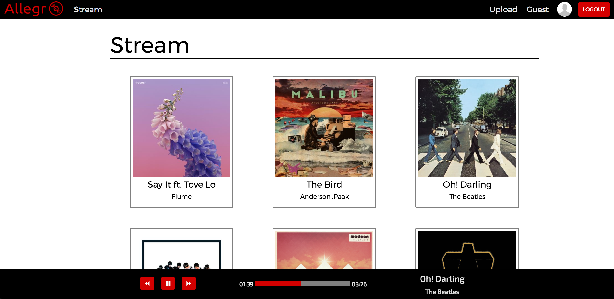
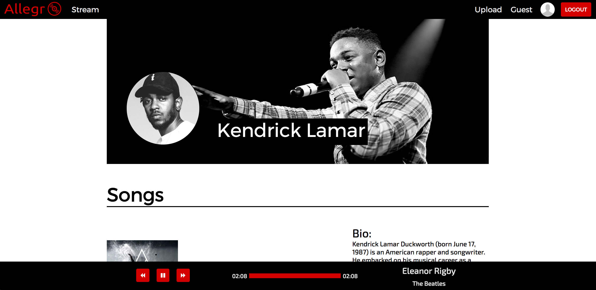

# Allegro
[Allegro.audio](allegro.audio) is a full-stack web application designed for users to upload and share music with others. It is inspired by SoundCloud and is built using a Ruby on Rails backend, a PostgreSQL database, and a React.js/Redux framework on the frontend.


## Features
- User authentication and profiles.
- Continuous playback of current song across all pages.



  The audio player is made of several React components built around the React Sound component in order to provide visual feedback and control for the user.

- Users can upload their own tracks
- Songs have their own pages where users can leave comments.


- Users have their own profile page which is customizable and displays their uploaded songs.



## Backend
- Allegro is powered by Ruby on Rails, and is hosted on Heroku. It provides RESTful APIs and responds with JSON data from the database.
- The database is run on PostgreSQL, and consists of 3 main tables: Users, Songs, and Comments. Songs and Comments are joined to Users by user_id, and Comments are joined to Songs by song_id.
- Audio and image files are stored externally through Cloudinary.
- BCrypt is used for password-salting and hashing for a secure authentication system.

## Frontend
- Allegro is built as a single page application by utilizing the React.js framework and Redux architecture.
- Node package manager (npm) is used to install all frontend dependencies
- Webpack is used to bundle all the frontend components together.
- jQuery is used to make AJAX requests to the server and to allow the user the ability to click adjust the music player.

## Technical Challenges
A major challenge was audio playback and how to make it continuous between pages. I decided on making my eventual SongPlayer component sit outside the App component that renders everything else.

The SongPlayer component is composed of several sub-components. The audio playback comes from the [React Sound](https://www.npmjs.com/package/react-sound) component, but all this does is play audio. In order to provide some sort of song info display and user control, I needed to built several other components.
```javascript
return (
  <div className="song-player animated fadeInUp" id={hidden}>

    <Player togglePlay={this.togglePlay.bind(this)}
            stop={this.stop.bind(this)}
            playStatus={this.props.nowPlaying.playStatus}
            forward={this.forward.bind(this)}
            backward={this.backward.bind(this)}
            className="song-player-player-container"/>

    <Progress position={this.props.nowPlaying.position}
              elapsed={this.props.nowPlaying.elapsed}
              total={this.props.nowPlaying.total}
              clickAdjust={this.clickAdjust.bind(this)}
              className="song-player-progress-container"/>

    <Details nowPlaying={this.props.nowPlaying}
     className="song-player-details-container"/>

    <Sound
          url={this.props.nowPlaying.song.song_url}
          playStatus={this.props.nowPlaying.playStatus}
          onPlaying={this.handleSongPlaying}
          playFromPosition={this.props.nowPlaying.playFromPosition}
          onFinishedPlaying={this.handleSongFinished.bind(this)} />
  </div>
);
```

The Progress component in particular required some additional thought. Normally one would expect the ability to click on a progress bar and have the song jump to the point where you clicked. To achieve this, I used jQuery to find the size and location of the progress bar, then calculate the ratio of the distance and apply it to to the total time of the current playing song.

```javascript
clickAdjust(xPosition) {
  let barWidth = this.state.$progressBar.width();
  let leftOffset = this.state.$progressBar.offset().left;
  let ratio = (xPosition - leftOffset) / barWidth;
  let newPosition = this.props.nowPlaying.totalSeconds * ratio;
  this.props.updatePlayingSong({playFromPosition: newPosition});
}
```

## Future Implementations
There are several features I have in mind for Allegro to be added in the future:

- Waveforms for audio files
- User likes
- User playlists
- Ability for users to follow other users
